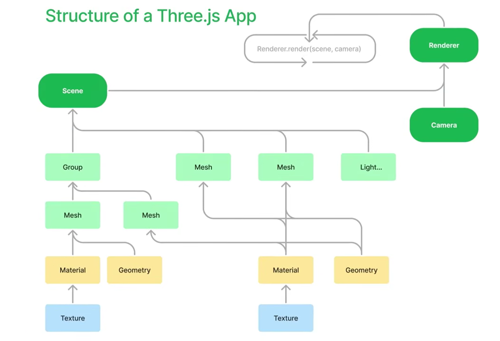

# Three Js

## What is 3js?
- a heigh-level JS library/API for creating and displaying 3D graphics in web browsers.
it simplifies 3D graphics without low-level WebGL code knowledge

**Graphics Processing:** rendering 3D graphics on computer screen in real-time. it requires millions of calculations per second.

**GPU:** Graphics Processing Unit. a special type of hardware to run simple calculation in parallel. 

## Why is it complex?
- computer needs to know information like the position, color and location of every vertex of an object

## What is WebGL?
- JS API for rendering 3D graphics in a web browser using the GPU.
it provides a language to talk to GPU and instruct it on what to render

**API:** a way to interface or instruct some underlying process. intention behind it is either abstract away *complex* stuff or *hide* whats actually going on underneath.

**Specific/low-level APIs:** more control, more complex.

**Abstract/high-level APIs:** easy to intract with, more limits.

- WebGL is more Specific API and ThreeJs is more abstract

## To Start ThreeJS
**Knowledge:** basic js : variable, object, loops, functions / basic math 

**Tools:** Chrome - VSCode - Blender(just needed for 3d modeling)

- [ThreeJS Documentation](https://threejs.org/docs/)
- [ThreeJS Examples](https://threejs.org/examples/)
- [ThreeJS GitHub Repo](https://github.com/mrdoob/three.js/tree/master)

## ThreeJs Fundamentals

### Hierarchy

- **Scene**
  - Group
    - Mesh
      - Material
        - Texture
      - Geometry
    - Mesh
      - Geometry
  - Mesh
    - Material
      - Texture
    - Geometry
  - Mesh
    - Material
    - Geometry
  - Light

### Rendering Flow

```js
renderer.render(scene, camera);
```

The renderer uses:

- **Scene** → contains every object that is viewable to user.
- **Camera** → defines the viewpoint.
- **Renderer** → draws the scene from the camera's perspective. to generate image(s)
    - **Render Loop** → call the render function x amount of time in seconed (mostly 60 per s)

*if we have a car in out scene:*
- **Texture** →
- **Material** →
- **Geometry** →
- **Mesh** → set material to item base on its geometry, each wheel.
- **Group** → combined of some meshes, the car.
- **Light** →
