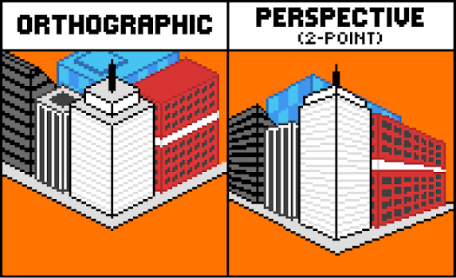
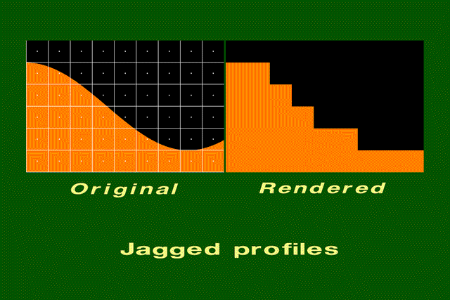
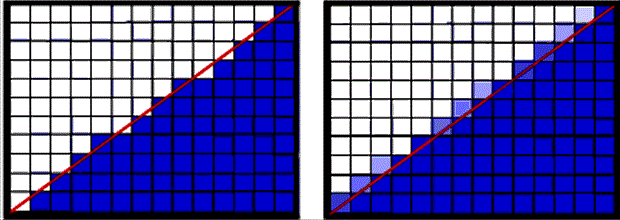
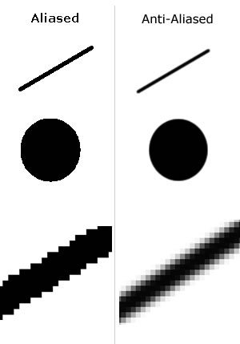

## camera

- **fov** : The vertical field of view. Default is 50.
  - the angle that captured by the lens. [visualization](https://observablehq.com/@grantcuster/understanding-scale-and-the-three-js-perspective-camera)
- **aspect** : The aspect ratio. Default is 1.
- **near** : The camera's near plane. Default is 0.1.
- **far** : The camera's far plane. Default is 2000.

- if set too small number for near and too big number for far, so it covers everything, it may cause `Z-fighting`

- the **far** number is the farthest distance that can be seen; and the **near** number is the closest distance that can be seen with camera. so if we set the position of camera for example `5`, and set the far to `7` and near to `1`, it means camera positioned at `5`, and can see distance between `1` and `7`:

```
      _____________________________
     |                             |
    `N`                 `C`       `F`
|----|----|----|----|----|----|----|----|
0    1    2    3    4    5    6    7    8
```
- so if we set the **far** number less that camera position, the item is not visible:
```
      _________
     |         |
    `N`       `F`       `C`       
|----|----|----|----|----|----|----|----|
0    1    2    3    4    5    6    7    8
```
- about **near** number, we should notice that when we set the **near** and position of the camera the same number, the camera actually is **inside** the item! so we have to minus at least half of the item geometry that is in the same axis of the camera, so we can see it. for example if the camera positioned at z = 5, and item is (1,1,1); the **near** value must be <4.5 so we can see it. ( 1 / 2 = 0.5, 5 - 0.5 = 4.5)
- with the same logic, the **far** number must be at least >=4.5

## Orbit Controls

- it allows the camera to orbit around the target
- [example](https://threejs.org/examples/misc_controls_orbit.html)
- it takes two parameter: camera and dom element
```js
const controls = new OrbitControls( camera, renderer.domElement );
```
- we can create it after canvas variable and rendering canvas, and just pass the canvas to it as the dom element:
```js
const canvas = document.querySelector("canvas.threejs"); // getting canvas
const renderer = new THREE.WebGLRenderer({canvas: canvas});  // pass the canvas as the renderer
const controls = new OrbitControls(camera, canvas); // create orbit control and pass canvas as dom element
```
### render loop

- call render once every frame

#### request animation frame

- if we just put the controls in the code, as js runs, it execute `renderer.render(scene, camera);` once, and thats it! any position items had in that moment, get captured and there is no more change to them.
- for fixing this, there are some trick that help us to execute code more than once, and times after first execute: `set timeout` , `set interval` and just creating a `loop`! but the problem is if we execute code with these, we get errors, crashes and Maximum call! because what actually happens is we call the function infinitely over and over again, and we actually don't want that!
- each device has **Frame Rate Gap**. usually devices has refresh rate of `60` or `120`. so if we want to have fluid experience  that **syncs** with the refresh rate of the screen, we want to match the screen refresh rate to how many times we execute renderer and actually rendering the renderer that many times.
- for rendering the renderer in needed sequences, and to sync it with different device refresh rates, we can use **Request Animation Frame**
- in browsers, we have access to global object `window`, which has method named `requestAnimationFrame`
- the `requestAnimationFrame` is a global function, that takes another function. and tells the computer: right before generating a new image(refresh and load a new frame) execute that function
```js
window.requestAnimationFrame(function)
```
- so in this way, we can render canvas, exactly as much as the computer refresh the frame in all devices. and we can create a loop for out renderer, but a loop that fot limited by device refresh rate, not an infinite loop:

```js
const renderLoop = () => {
    renderer.render(scene, camera);
    window.requestAnimationFrame(renderLoop);
};

renderLoop();
```

## Orthographic Camera
- despite perspective camera, it does not have any perspective. it shows the size of object as they are, regardless of how far are they from camera. 



- in this type of camera, instead of fov, we have a square and for that, camera gets left, right, top, and bottom sizes. 

```js
const camera = new THREE.OrthographicCamera(-1, 1, 1, -1, 0.1, 200);
```

- with this dimensions, it tells the renderer to render and square with 1*1 dimensions. but because we render it in desktop or mobile browser and these devices doesn't have 1/1 aspect ration, the result might be stretched. so to fix that, we multiply left and right by window aspect ratio:

```js
const aspectRatio = window.innerWidth / window.innerHeight;
const camera = new THREE.OrthographicCamera(-1 * aspectRatio, 1 * aspectRatio, 1, -1, 0.1, 200);
```

## Resize
- in out project, we set size once in codes:
```js
renderer.setSize(window.innerWidth, window.innerHeight);
```
so if after running for first time, if we change the size of browser, either blank space adds to page(when gets bigger) or the scene gets cut in(when gets smaller)

- for fixing it, we can add set size to render loop, so it gets updated every frame:
```js
const renderLoop = () => {
    // set the size of renderer(canvas) to the browser page
    renderer.setSize(window.innerWidth, window.innerHeight);

```
but we still have size problem. because now when user resize the browser, the canvas updates correctly, but the camera aspect ratio we set is still setting once:
```js
const aspectRatio = window.innerWidth / window.innerHeight;

const camera = new THREE.PerspectiveCamera(35, aspectRatio, 0.1, 200);
```
so the browser gets resized, the canvas gets updated but the camera still having the same ratio we passed to it, so it tries to fit that old ratio to new sizes, and it make out objects deformed.

- based on [Three.js documents](https://threejs.org/docs/pages/PerspectiveCamera.html#isPerspectiveCamera):
```
.isPerspectiveCamera : boolean (readonly)
```
so we can not just pass the camera or update it later in code, or in render loop

- but we can update and change a property named **.aspect : number**:
```js
const renderLoop = () => {
    //update the camera ratio
    camera.aspect = window.innerWidth / window.innerHeight;

```
- and again base on [Three.js documents](https://threejs.org/docs/pages/PerspectiveCamera.html#isPerspectiveCamera):
```js
.updateProjectionMatrix()

// Updates the camera's projection matrix. Must be called after any change of camera properties.
```
so the item in page stays in the same ratio in resizing

- but we still have a problem! because now we reset those size settings in every frame, even if not needed.
- so instead of that, we add **resize event listener** and put them inside that:
```js
window.addEventListener("resize", () => {
    //update the camera ratio
    camera.aspect = window.innerWidth / window.innerHeight;
    //updates the camera Matrix
    camera.updateProjectionMatrix();
    // set the size of renderer(canvas) to the browser page
    renderer.setSize(window.innerWidth, window.innerHeight);
});
```
and now, resize settings gets called and updated only when needed.

## Aliasing
- line and shapes get render on display, on **pixels**. each pixel is a small square. so when we have a strait horizontal/vertical line, it exactly matches the edge of row of square and we have no problem. but when we have a tilted line, in rendering it becomes a  staircase pattern with pointy edges. 



- to solving this problem, we have both **Hardware** and **Software** solution. 
    - **Hardware Solution:** like what happens in *Retina Screen*, we can put more pixels in the same place, so human eye cannot distinguish the edges. to provide higher *pixel ratio*. [Steve Jobs explains about Retina Screen](https://www.youtube.com/watch?v=kcnKi7GxZ2k)

    - **Software Solution:** to start to shade the edge pixels with slightly different(lighter) color to create gradient like effect. so the software creates an illusion of softer line.

 

- both of these solution make the shapes and lines smoother and softer. these called **Anti Aliasing (AA)**.



- we can use some tools to use AA in our project and make softer lines in our shapes when rendering.

### Anti Aliasing (AA)
**Hardware**
- we can set the renderer pixel aspect ratio to the device with this:
```js
renderer.setPixelRatio(window.devicePixelRatio);
```
so if the device had more than 1, use that to handle the antilles with hardware. 
- because there may be devices with much higher pixel Ratio, it's better to use this instead:
```js
const maxPixelRatio = Math.min(window.devicePixelRatio, 2);
renderer.setPixelRatio(maxPixelRatio);
```
so we have a limit on it.

**Software**
- we can simply use the ThreeJs antialias tool to fix this problem:
```js
const renderer = new THREE.WebGLRenderer({canvas: canvas, antialias: true});
```