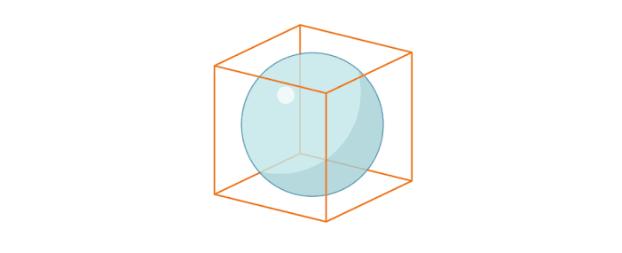
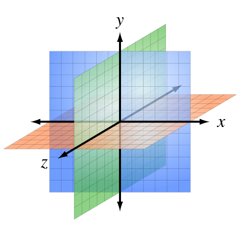
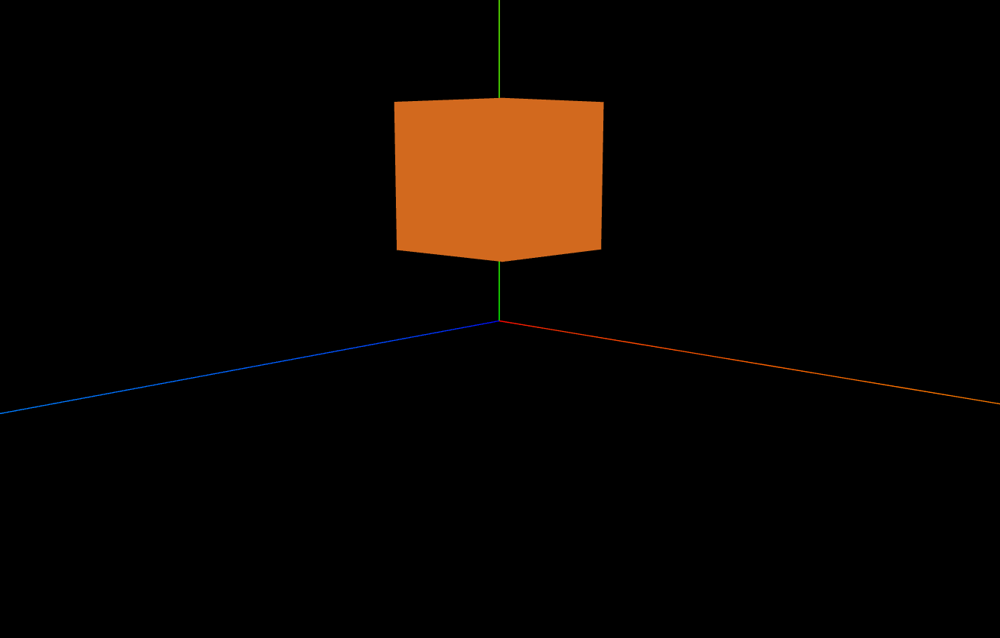
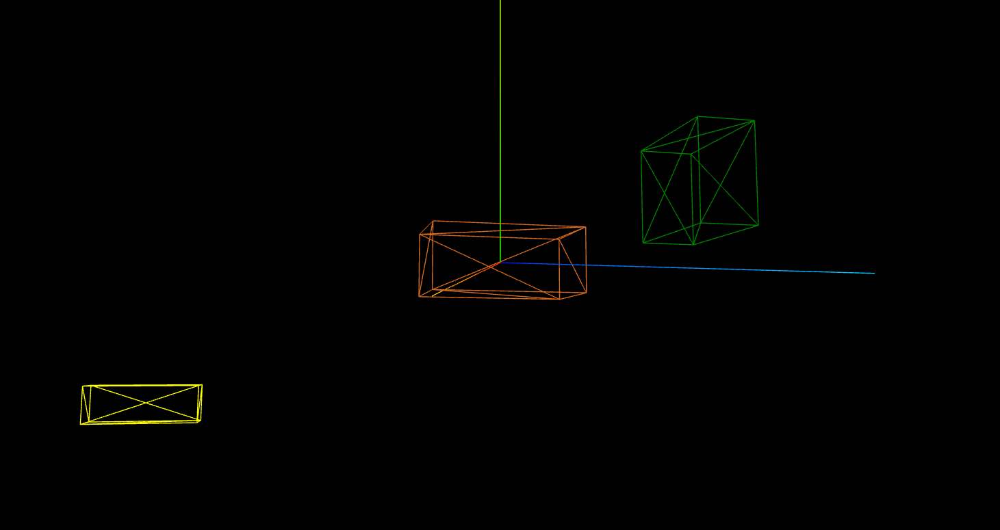
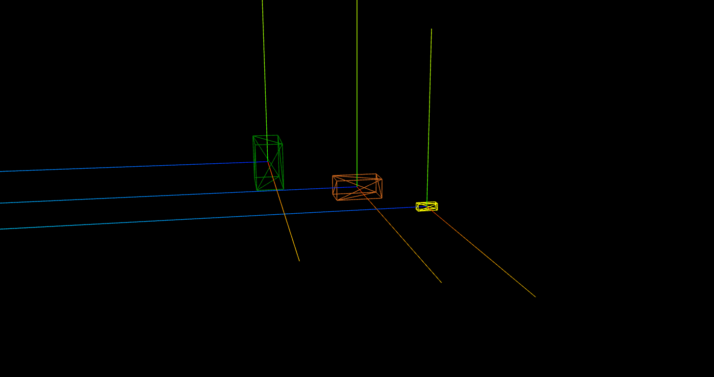

## transformation

- we already talked about *camera* and *renderer*, so no we want to talk about things exist within a **scene**.
- for a basic applications, we just add a *material* and *geometry* and mesh them and add that object to the scene:
```js
const cubeGeometry = new THREE.BoxGeometry(1, 1, 1);
const cubeMaterial = new THREE.MeshBasicMaterial({ color: "Chocolate", wireframe: false });
const cubeMesh = new THREE.Mesh(cubeGeometry, cubeMaterial);
```
- a little later we talk about different types of materials and geometries, but now we want to talk specifically about **Mesh** and *manipulation* and *transformations* that we can apply to them, specifically the **position**, **rotation** and **scale**.

### mesh
#### **position**
- the first thing we changed in transformation at the beginning, was changing the *camera* position:
```js
camera.position.z = 5;
```
- we did that because the if we don't, the default position of camera and the object we created is `0` and this causes the camera to be **inside** the item, so we dont see it.



- so just like that, we also can change the position of the object it self:

```js
cubeMesh.position.y = 1
```

- the unit we use in our project is arbitrary, but it's important that the other parts of application respect that unit and ratio. 
- for positions, we have `x`, `y` and `z` axis.



- we can append them in the scene with `axesHelper` :

```js
const axesHelper = new THREE.AxesHelper(10);
scene.add(axesHelper)
```
- the color of axis are: `y: green`, `x: red`, `z: blue`



#### **Vector 3**
- vector 3 is actually set of 3 numbers labeled x,y,z : `(x,y,z)`. it can tell the threejs that exactly where the item is positioned.
- there are some method we can use to manipulate vector 3
    1. we can create a vector 3 position and pass it to an object in scene with `.copy`:
    ```js
    const newVector3 = new THREE.Vector3(0,5,0);
    cubeMesh.position.copy(newVector3)
    ```
    - in this case, the `y` position of `cubeMesh` becomes `5`
    2. we can calculate the distance between two vector3 item in page with `.distanceTo`:
    ```js
    cubeMesh.position.distanceTo(camera.position)
    ```

#### **transforming scale**
- we can change the scales of item in `x,y,z` axis with `.scale`:
```js
cubeMesh.scale.z = 2
```
- and also change all the axis scale with `set()`:
```js
cubeMesh.scale.set(2,1.5,0.2)
```

### group
- a way to collect some items in scene and change their properties at the same time, is to **group** them.
- we can simply create a group and just like the scene, add items to it:

```js
const group = new THREE.Group();
group.add(cubeMesh);
group.add(cubeMesh2);
group.add(cubeMesh3);

scene.add(group)
```

- and after that, we can easily apply changes to all them, by applying the change to the *group*:

```js
group.scale.y = 2;
``` 

- each item has its own properties, and group properties change the item properties relative to its own properties. so for example if we have two cubes with geometry of `(1,1,1)` and `(3,3,3)` and add them to a group, and then we set the scale of the group to `2`, the result will be `(2,2,2)` and `(6,6,6)`

## more

- **wireframe**: instead of solid color, it adds shows the real wireframe of the mesh:
```js
const cubeMaterial = new THREE.MeshBasicMaterial({ color: "Chocolate", wireframe: true });
```



- instead of adding the `axesHelper` to the scene, we can actually add them to the item. in this case, what ever we change in item position, the axes will be connected to the item instead of the scene:

```js
const axesHelper = new THREE.AxesHelper(10);
const axesHelper2 = new THREE.AxesHelper(10);
const axesHelper3 = new THREE.AxesHelper(10);
//scene.add(axesHelper)
cubeMesh.add(axesHelper);
cubeMesh2.add(axesHelper2);
cubeMesh3.add(axesHelper3);
```

