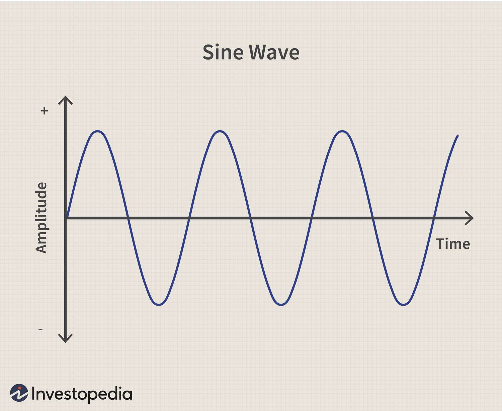
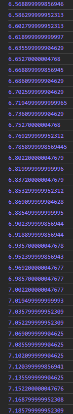
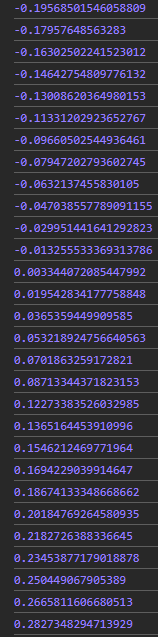

# Animation
- animation is actually transformations applied dynamically.
- so like how animation actually work, we make some transformation, and after each change, we take a picture (a frame) and if we have enough frames, when we play these images sequently, it looks ike fluid video.

## delta time
- **delta time** is time between two **frames**. so if a game plays in `60fps` (frame per seconde), the delta time would be `1/60s` (~0.01666666666666667s)

- we can calculate delta time in this order:
    - we create a clock that starts timing from the point we initializing it:

    ```js
    const clock = new THREE.Clock();
    ```
    - because `Clock()` returns an object with many data, we just get the `ElapsedTime` which returns counter in seconde:

    ```js
    const currentTime = clock.getElapsedTime();
    ```
    
    - so when we put this inside the renderloop, we can simply calculate the delta time:
    
    ```js
    const delta = currentTime - previousTime;
    ```

    - and we set previous time like this:

    ```js
    previousTime = currentTime;
    ```
    - so after each frame, it gets the latest frame seconde.
    the final structure for it would be:

    ```js
    const clock = new THREE.Clock(); // create the clock object
    let previousTime = 0; // set the previous time for the first round

    const renderloop = () => {

    const currentTime = clock.getElapsedTime(); // get elapsed time to get timer in seconde
    const delta = currentTime - previousTime; // calculate delta time
    previousTime = currentTime; // set the previous time for next calculation

    ```

- by using **delta time**, we can easily set an animation, **independent** from device frame rate. so as long as `delta` is a part of equation in our animations, it would be independent from device frame rate. so for example:

```js
cubeMesh.rotation.y += THREE.MathUtils.degToRad(1) * delta * 50
```
- this animation would behave same in all devices

## sine wave
- if we use the same method we use for rotation, for some other animations like position or scale, we eventually lose our object from the camera view. so if we use:
```js
cubeMesh.position.y += 1;
cubeMesh.scale.y += 1;
```
- the item eventually goes out of the camera view or gets too big to fit in it! so we use **Sine Wave** animation instead.



- so if we pass a value to sin function, it stays between `+1` and `-1`
- for example we have `currentTime` in our previous example, which has a increasing linear output like this:



- but with using sine function:

```js
Math.sin(currentTime);
```
- we can keep it between `+1` and `-1`:



- so we can simply use this to have a loop animation for linear transformations like scale or position:

```js
cubeMesh.scale.x = Math.sin(currentTime);
```
- we also can make any customizing we want with performing various computational operations on sine functions.