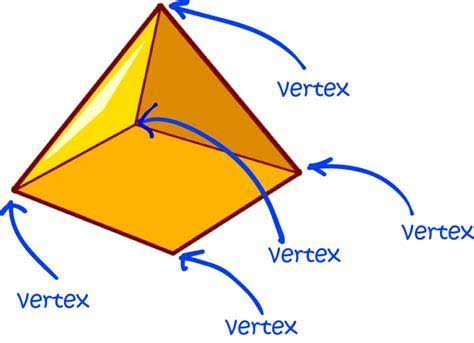
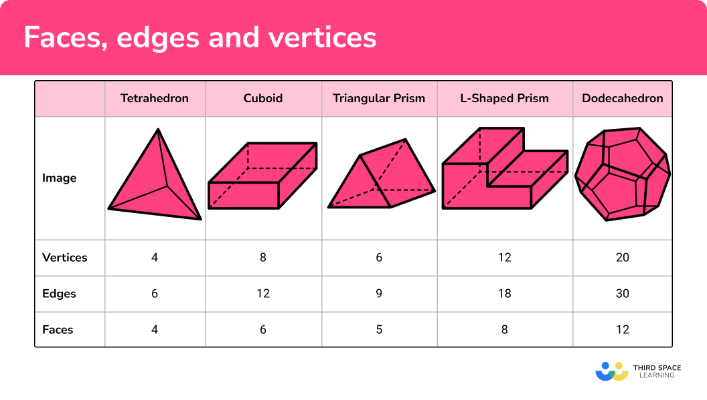
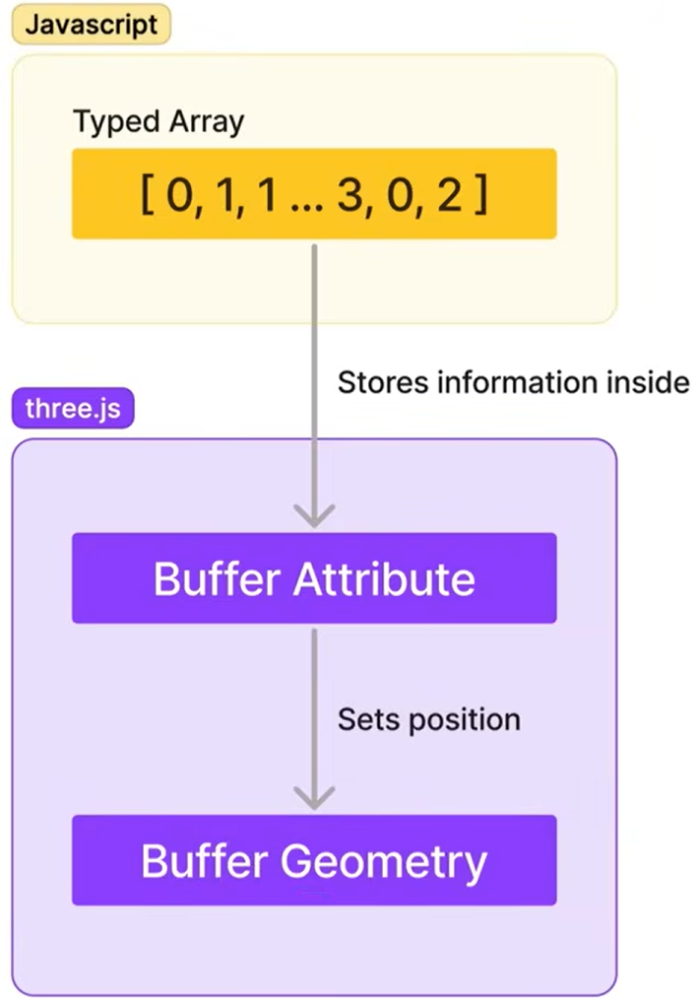
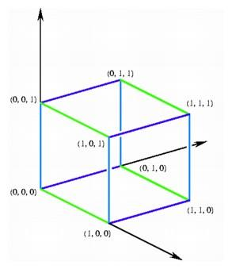
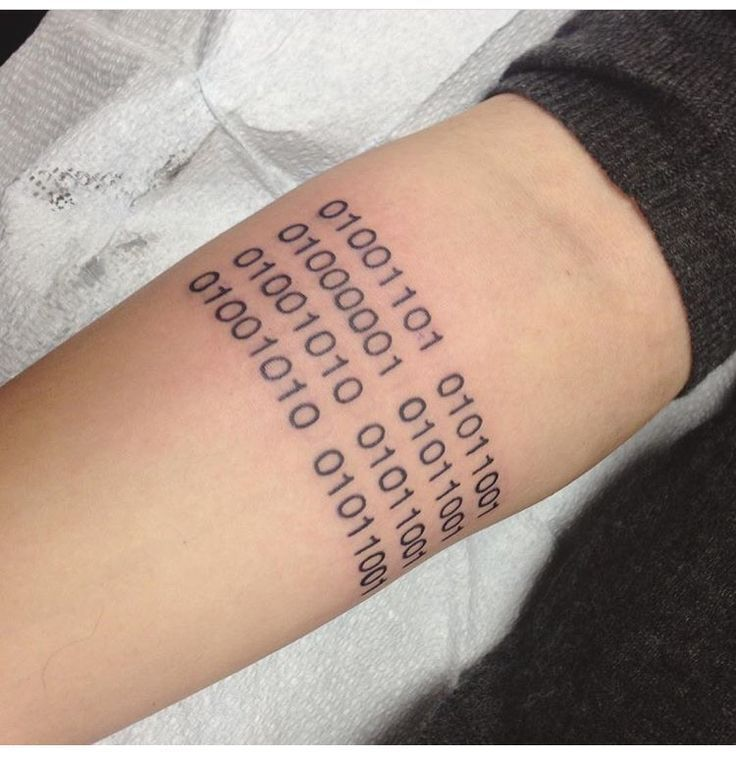
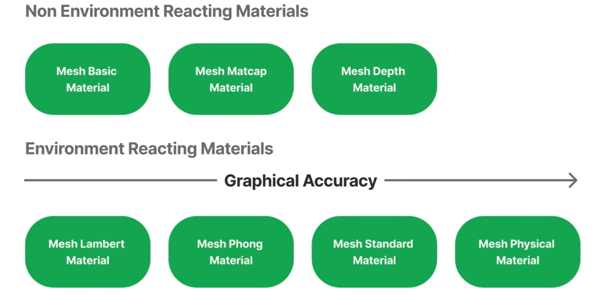
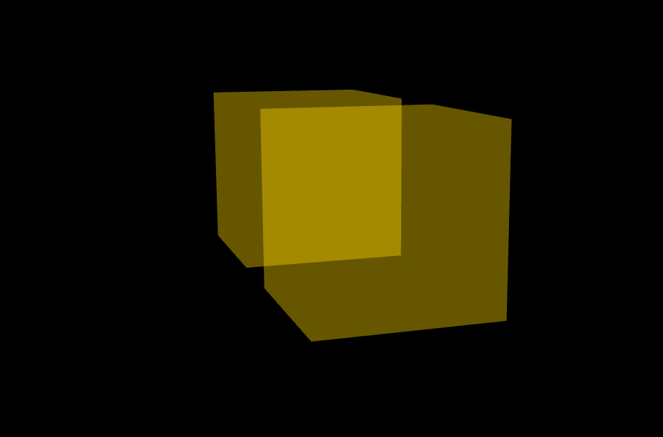
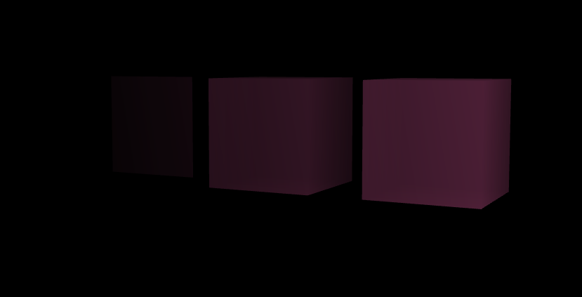
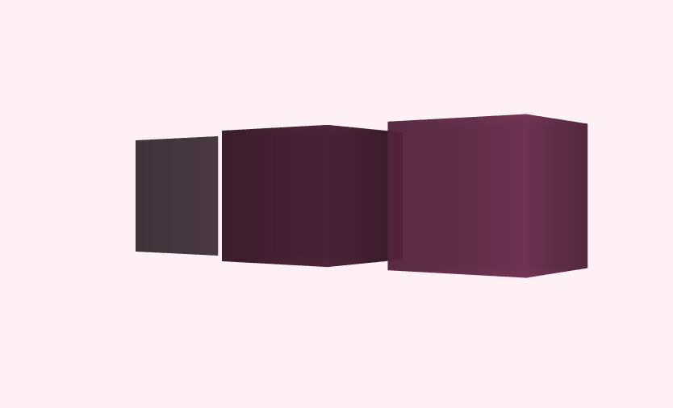
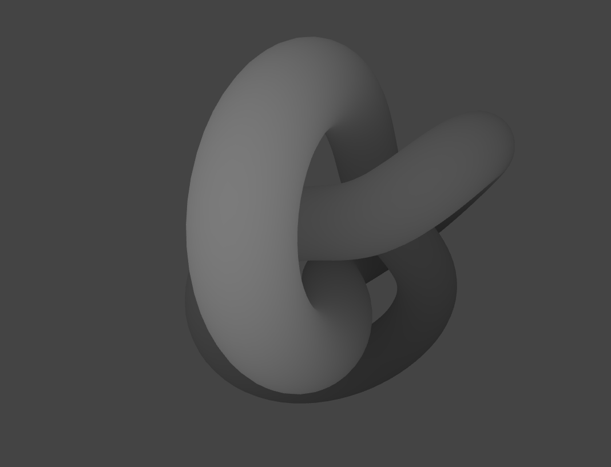

# Mesh

## Geometry
- to add an item to the scene, we have two ways: 
    - to add 3js own geometries called **Primitives**
    - the other way to add a geometry is to do it from **Scratch**
        - by using 3d applications like **blender**
        - **BufferGeometry**

### Buffer Geometry
- the type of geometry where vertex data is stored in the memory as binary arrays or buffers. 
- the vertices in general refers to pointes between at least two edges of a shape


 

- all the primitive we use for geometry, like `BoxGeometry`, use `BufferGeometry` under the hood.
- to create an item with BufferGeometry:
    - create a new geometry

    ```js
    const geometry = new THREE.BufferGeometry();
    ```
    - determine vertices 
    
    ```js
    const vertices = new Float32Array( [
        -1.0, -1.0,  1.0, // v0
         1.0, -1.0,  1.0, // v1
         1.0,  1.0,  1.0, // v2
         1.0,  1.0,  1.0, // v3
        -1.0,  1.0,  1.0, // v4
        -1.0, -1.0,  1.0  // v5
    ] );
    ```

    - set the vertices as the geometry attribute

    ```js
    geometry.setAttribute('position', new THREE.BufferAttribute(vertices, 3));
    ```

    - create material

    ```js
    const material = new THREE.MeshBasicMaterial({color: 0xff0000});
    ```

    - mesh the item

    ```js
    const mesh = new THREE.Mesh(geometry, material);
    ```
    

- when we create vertices positions with `Float32Array`, we actually set the `x,y,z` of each vertices on the axis.



- when we set `BufferAttribute` it takes three parameters:
    - array : the list of the vertex (Float32Array)
    - itemSize : the number of axis we have, so it knows how many numbers must be in each group when separate them (3)
    - normalize : 

### Primitives
- there is some primitive shapes that we can use and adjust them to add them to the scene:
    - BoxGeometry
    - CapsuleGeometry
    - CircleGeometry
    - ConeGeometry
    - DodecahedronGeometry
    - ExtrudeGeometry
    - IcosahedronGeometry
    - LatheGeometry
    - OctahedronGeometry
    - PlaneGeometry
    - RingGeometry
    - ShapeGeometry
    - SphereGeometry
    - TetrahedronGeometry
    - TorusGeometry
    - TorusKnotGeometry
    - TubeGeometry
    - CylinderGeometry

- for some of them, we just need to create `Geometry` and `Material`, `Mesh` them and add to the scene. for example:

```js
//ConeGeometry
const coneGeometry = new THREE.ConeGeometry(4, 22, 20);
const coneMaterial = new THREE.MeshBasicMaterial({color:"DarkRed", wireframe: true});
const cone = new THREE.Mesh(coneGeometry, coneMaterial);
scene.add(cone);
```

- but for some of them, we need to set more setting before adding to the set:

```js
//ExtrudeGeometry
const extrLength = 12, extrWidth = 8;
const extrShape = new THREE.Shape();
extrShape.moveTo(0,0);
extrShape.lineTo(0, extrWidth);
extrShape.lineTo(extrLength,extrWidth);
extrShape.lineTo(extrLength,0);
extrShape.lineTo(0,0)
const extrudeGeometry = new THREE.ExtrudeGeometry(extrShape);
const extrMaterial = new THREE.MeshBasicMaterial({color: "DeepPink", wireframe: true});
const extrude = new THREE.Mesh(extrudeGeometry, extrMaterial);
scene.add(extrude)
```
- the complete structure of how to use and set them is available at [ThreeJs Documentations](https://threejs.org/docs/) .

### Materials
- **Geometry** impacts the shape of the mesh, and **Material** impacts the look of the shape. things like color, shininess, different patterns. also it's important that understand the distinguish between the **Material** and the **Texture**. Texture is part of the material, it's the part that that makes up the way that material ends up looking, it's not the same concept.
- Material can stands on its own, it does not need texture, it can define the look and feel of the object itself, but you can add a texture to add more information about what could be on the pattern of the material.
- for example the material of a hand is skin, and a tattoo on it would be texture that defines patterns on it.



- the material defines the skin color, light reflection, how matt it is. 

#### **Material Types**
- Material has different properties such as *roughness*, *reflectiveness*, *shininess*, *matt amount* etc.
- These properties all respond to **Light**.
- till now, we did not use any light in our samples and all shapes has solid color which looks the same at all angles and has no respond to the light. that's because we have two type of materials in threejs:
    - **None-Environment Reacting Material**
        - Mesh Basic Material
        - Mesh Matcap Material
        - Mesh Depth Material
    - **Environment Reacting Material**
        - Mesh Lambert Material
        - Mesh Phong Material 
        - Mesh Standard Material 
        - Mesh Physical Material 
            - ( from top to bottom, **Graphical Accuracy** increases. first one looks more fake and the last one look more realistic. ) 



- different material can coexist in a scene, so we can have a material that responds to light and  an environment that doesn't respond to the light. it may physically inaccurate, but depend on the context of the project, we can use both type in the scene at the same time. 

#### **MeshBasicMaterial**

```js
const objectMaterial = new THREE.MeshBasicMaterial({})
```

- there are different properties we can set in this type of material:
    - `color: "blue"` //can use any type of color like hex, rgb, name etc.
    - `transparent: true` //need this structure to apply correctly:

        ```js
        const objectMaterial = new THREE.MeshBasicMaterial({
            color: "red",
            transparent: true,
            opacity: 0.4
        }) // to see the change, we need something else like another mesh
        ```
        
        - we also can change properties of an mesh, after creating it with methods:

        ```js
        objectMaterial.transparent = true;
        objectMaterial.opacity = 0.5;
        ```
        - color property is an exception. so for changing the color after creating a mesh, we use this:

        ```js
        objectMaterial.color = new THREE.Color("green")
        ```
    - `side`: for a **PlaneGeometry**, we need to add sides. because in threejs by default, item has one side and if we add a plane to the scene, and turn the camera, it got disappeared. so we can add the other side like this:

    ```js
    objectMaterial.side = THREE.DoubleSide;
    //OR
    objectMaterial.side = 2;
    ```

    - `fog`:  define a linear fog that grows linearly denser with the distance.

        ```js
        const fog = new THREE.Fog("color", near, far);
        scene.fog = fog;
        ```
        - to see the fog better and use it properly, its better that the color of the fog and background be same.

        
    
    - `background`: this one actually is a scene property:

    ```js
    scene.background = new THREE.Color('#FFF0F5')
    ```
    

#### **MeshDepthMaterial**
- A material for drawing geometry by depth. Depth is based off of the camera near and far plane. White is nearest, black is farthest.

