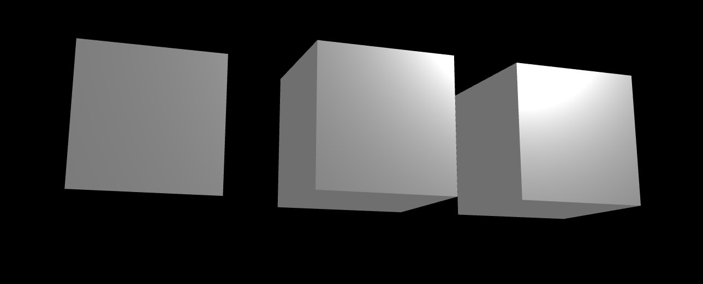
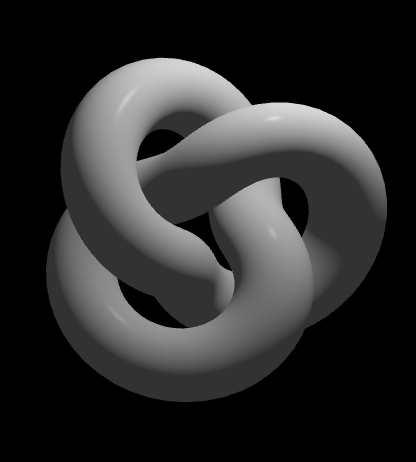
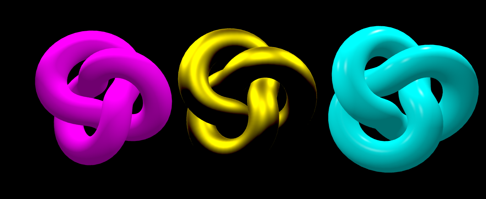
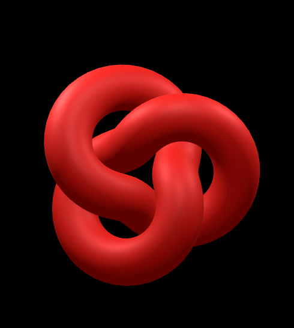
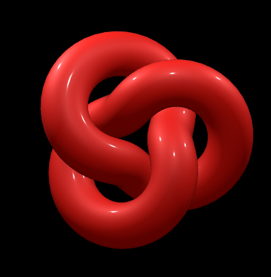
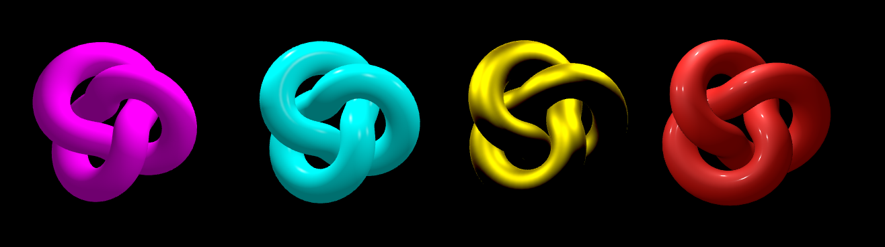

# Materials
- **Geometry** impacts the shape of the mesh, and **Material** impacts the look of the shape. things like color, shininess, different patterns. also it's important that understand the distinguish between the **Material** and the **Texture**. Texture is part of the material, it's the part that that makes up the way that material ends up looking, it's not the same concept.
- Material can stands on its own, it does not need texture, it can define the look and feel of the object itself, but you can add a texture to add more information about what could be on the pattern of the material.
- for example the material of a hand is skin, and a tattoo on it would be texture that defines patterns on it.


- the material defines the skin color, light reflection, how matt it is. 

## **Material Types**
- Material has different properties such as *roughness*, *reflectiveness*, *shininess*, *matt amount* etc.
- These properties all respond to **Light**.
- till now, we did not use any light in our samples and all shapes has solid color which looks the same at all angles and has no respond to the light. that's because we have two type of materials in threejs:
    - **None-Environment Reacting Material**
        - Mesh Basic Material
        - Mesh Matcap Material
        - Mesh Depth Material
    - **Environment Reacting Material**
        - Mesh Lambert Material
        - Mesh Phong Material 
        - Mesh Standard Material 
        - Mesh Physical Material 
            - ( from top to bottom, **Graphical Accuracy** increases. first one looks more fake and the last one look more realistic. ) 


- different material can coexist in a scene, so we can have a material that responds to light and  an environment that doesn't respond to the light. it may physically inaccurate, but depend on the context of the project, we can use both type in the scene at the same time. 

### **MeshBasicMaterial**

```js
const objectMaterial = new THREE.MeshBasicMaterial({})
```

- there are different properties we can set in this type of material:
    - `color: "blue"` //can use any type of color like hex, rgb, name etc.
    - `transparent: true` //need this structure to apply correctly:

        ```js
        const objectMaterial = new THREE.MeshBasicMaterial({
            color: "red",
            transparent: true,
            opacity: 0.4
        }) // to see the change, we need something else like another mesh
        ```
        
        - we also can change properties of an mesh, after creating it with methods:

        ```js
        objectMaterial.transparent = true;
        objectMaterial.opacity = 0.5;
        ```
        - color property is an exception. so for changing the color after creating a mesh, we use this:

        ```js
        objectMaterial.color = new THREE.Color("green")
        ```
    - `side`: for a **PlaneGeometry**, we need to add sides. because in threejs by default, item has one side and if we add a plane to the scene, and turn the camera, it got disappeared. so we can add the other side like this:

    ```js
    objectMaterial.side = THREE.DoubleSide;
    //OR
    objectMaterial.side = 2;
    ```

    - `fog`:  define a linear fog that grows linearly denser with the distance.

        ```js
        const fog = new THREE.Fog("color", near, far);
        scene.fog = fog;
        ```
        - to see the fog better and use it properly, its better that the color of the fog and background be same.

        
    
    - `background`: this one actually is a scene property:

    ```js
    scene.background = new THREE.Color('#FFF0F5')
    ```
    

### **MeshMatcapMaterial**
- does not respond to lights. It will cast a shadow onto an object that receives shadows (and shadow clipping works), but it will not self-shadow or receive shadows.

### **MeshDepthMaterial**
- A material for drawing geometry by depth. Depth is based off of the camera near and far plane. White is nearest, black is farthest.


### **MeshLambertMaterial**
- A material for non-shiny surfaces, without specular highlights. This can simulate some surfaces (such as **untreated wood** or **stone**) well, but cannot simulate shiny surfaces with specular highlights (such as varnished wood).

- for using this, we need to add some information about the environment such as *light*.

- so we need to add **Light** to the scene to be able to use this mesh:

```js
const light = new THREE.AmbientLight("white", 0.5);
scene.add(light);
```
- the `AmbientLight`, lights up everything in the scene equally, which is not a thing in real world, because in real world, every light has a source. but this kind of light, brights everything in the scene equally, so we cannot distinguish distance and edges and so on. so its basically like `MeshBasicMaterial`

- on the other hand, we have `PointLight` which is like a normal light, and has a source of light:

```js
const pointLight = new THREE.PointLight(0xffffff, 5);
pointLight.position.set(1,1,1);
scene.add(pointLight);
```
- so in this type of light, we actually can see depth and shadows



### **MeshPhongMaterial**
- A material for shiny surfaces with specular highlights.
- with this mesh, we ar able to change shininess of objects.

```js
const cubeMaterial = new THREE.MeshPhongMaterial();
cubeMaterial.shininess = 400;
```



### **MeshStandardMaterial**
- A standard physically based material, using Metallic-Roughness workflow.
- `PBR: Physically Based Rendering`: standard in many 3D applications, such as Unity, Unreal and 3D Studio Max.
- This approach differs from older approaches in that instead of using approximations for the way in which light interacts with a surface, a physically correct model is used. The idea is that, instead of tweaking materials to look good under specific lighting, a material can be created that will react 'correctly' under all lighting scenarios.
- In practice this gives a more accurate and realistic looking result than the MeshLambertMaterial or MeshPhongMaterial, at the cost of being somewhat more computationally expensive.

- to use this material, we need to pass some information about `metalness` and `roughness`.

```js
const standardMaterial = new THREE.MeshStandardMaterial();
standardMaterial.color = new THREE.Color(0xfff000);
standardMaterial.metalness = 1.4;
standardMaterial.roughness = 0.55;
```

from left: *Lamber* - *Standard* - *Phong*

### **MeshPhysicalMaterial**
- An extension of the MeshStandardMaterial, providing more advanced physically-based rendering properties such as `Anisotropy`, `Clearcoat`, `Iridescence`, `transparency`, `reflectivity` and `Sheen`.

    - **Reflectivity**:
    ```js
    const physicalMaterial = new THREE.MeshPhysicalMaterial();
    physicalMaterial.color = new THREE.Color(0xf00f00);
    physicalMaterial.metalness = 0.2;
    physicalMaterial.roughness = 0.58;
    physicalMaterial.reflectivity = 0.55;
    ```
    

    - **ClearCoat**:
    ```js
    const physicalMaterial = new THREE.MeshPhysicalMaterial();
    physicalMaterial.color = new THREE.Color(0xf00f00);
    physicalMaterial.metalness = 0.2;
    physicalMaterial.roughness = 0.58;
    physicalMaterial.reflectivity = 0.55;
    physicalMaterial.clearcoat = 1;
    ```
    

## final compare

from left: *lamberMaterial* - *phongMaterial* - *standardMaterial* - *physicalMaterial*