# Texture Maps

## UV Map
- as you see, same texture applies differently on each item:

 

- **UV Map** is a way to tell 3js how map a texture on an item.


- threejs and blender have different default uv map logic. blender opens the item faces, and map one texture to whole of it. but threejs map texture to each face of item, separately:


## PBR Map
- **Physically Based Rendering (PBR)** channels are the distinct data paths or texture maps used to define how **light** interacts with a 3D surface.

- **Core PBR Channels** :
    - **Base Color (Albedo)** : Stores the pure surface color of an object without ambient lighting or shadows.

    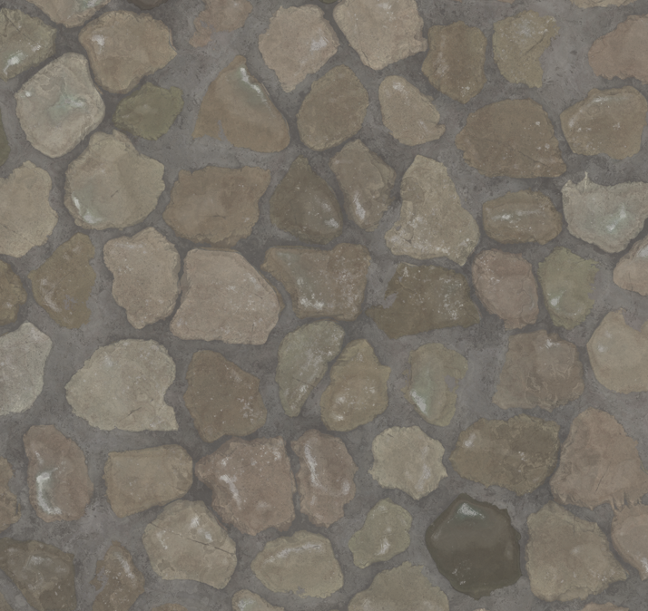
    
    - **Normal Map** : Uses the RGB color channels to simulate fine bumps, grooves, and surface depth without extra geometry.

    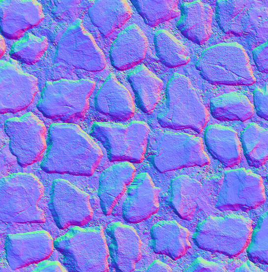

    - **Roughness** : A grayscale channel that controls how smooth or rough a surface is, dictating how sharp or blurry light reflections appear.

    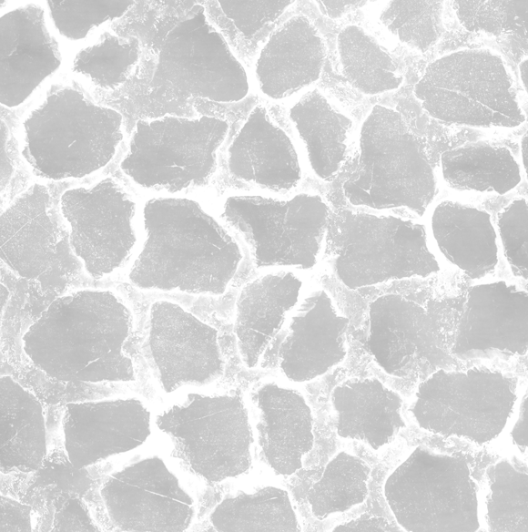

    - **Metallic** : A grayscale channel that determines if a surface behaves as a metal (reflective with tinted reflections) or a non-metal (dielectric).

    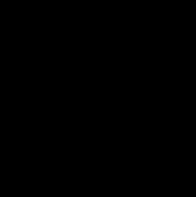

    - *like this one, in some textures, some of the maps may be solid black, which means that texture has no channel in that category. for example in this texture, rock has no metalness*

    - **Ambient Occlusion (AO)** : A grayscale map that darkens creases, holes, and areas where light is blocked from ambient lighting.

    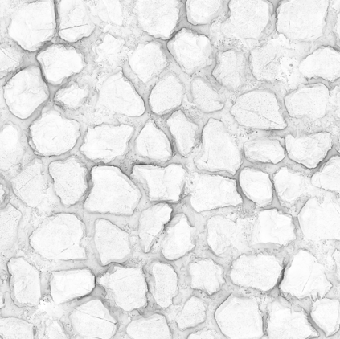

    - **Height / Displacement** : A grayscale map that drives actual vertex displacement or parallax occlusion to give real physical depth to surfaces.

    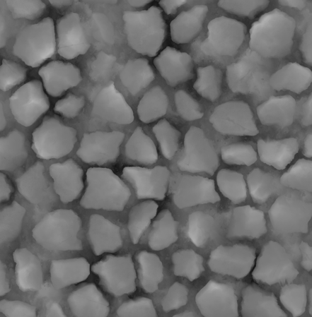

    - **Emissive** :  Controls areas of the model that emit their own light.

    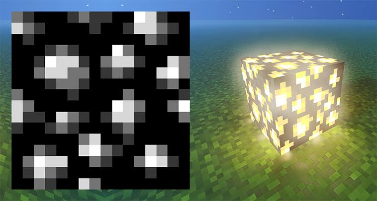

    ```js
    // 1. Load your textures
    const textureLoader = new THREE.TextureLoader();

    const colorTexture = textureLoader.load('/path/to/albedo.jpg');
    const roughnessTexture = textureLoader.load('/path/to/roughness.jpg');
    const metalnessTexture = textureLoader.load('/path/to/metallic.jpg');
    const normalTexture = textureLoader.load('/path/to/normal.jpg');
    const aoTexture = textureLoader.load('/path/to/ao.jpg');

    // 2. Map textures to material channels
    const material = new THREE.MeshStandardMaterial({
    map: colorTexture,                  // Base Color (Albedo)
    roughnessMap: roughnessTexture,    // Roughness Channel
    metalnessMap: metalnessTexture,    // Metallic Channel
    normalMap: normalTexture,          // Normal Map (Bumps)
    aoMap: aoTexture,                  // Ambient Occlusion
    });
    ```

    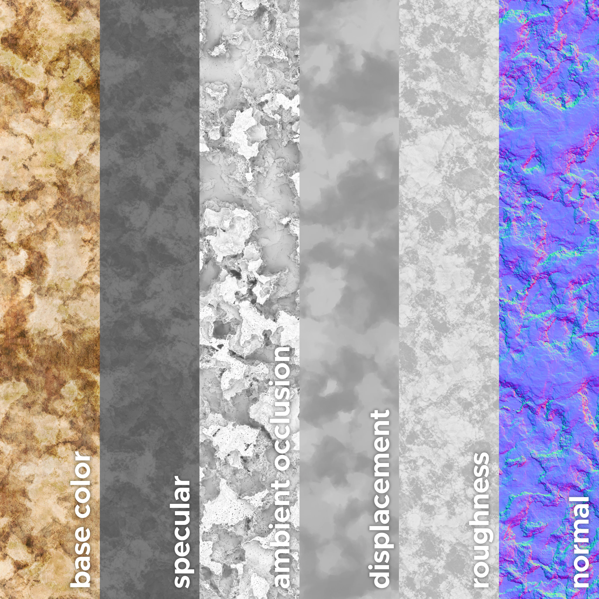

### Normal Map
- after all we changed, we still have a problem, that the object is in 3d and have dimensions, but the texture itself still looks very flat

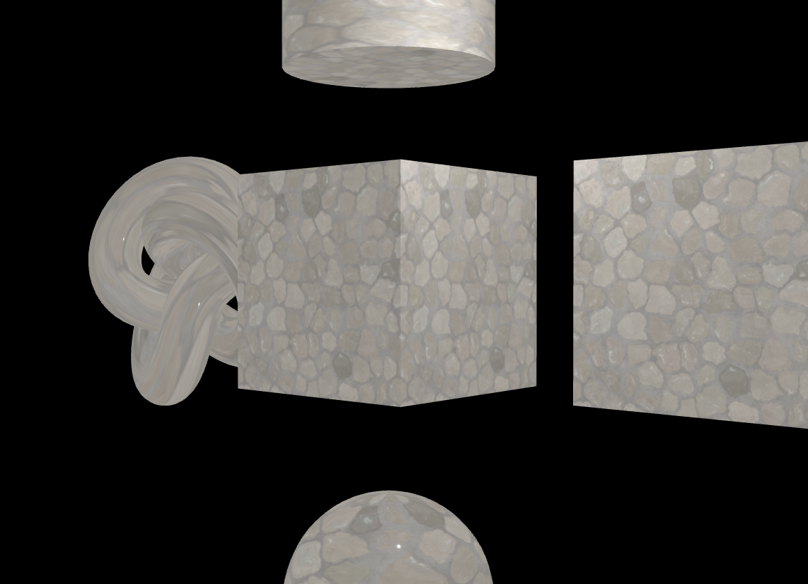

- regardless of how much details we add to the texture, at least in base color it would not behave like how **light** actually react and bounce on the same texture in real life. we can basically just *model* the texture completely, but for example if we have grass texture, there may be millions of grass in a simple geometry, and creating and rendering that model is too heavy and complicated. the other way to make that **illusion**. it's basically **simulate** the way light behave on that surface and texture. the way to tell the threejs light behavior for our texture, is to provide it in the form of a **Normal Map**.
- the Normal Map, is the map that holds the information about how to fake the light bounce and behavior on our texture. it tells threejs how out texture looks, in *different angels*.

    - **before Normal Map** : 
    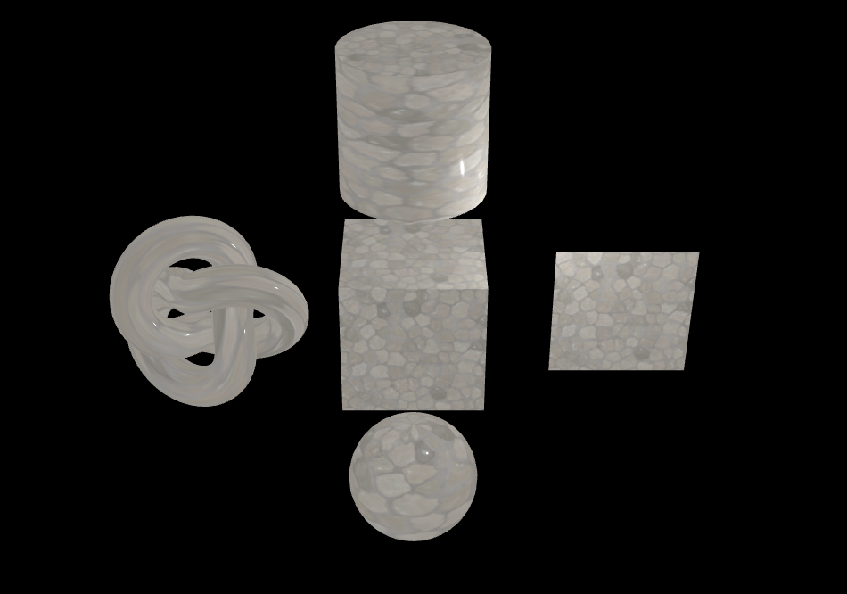
    - **after Normal Map** : 
    ```js
    const textureNormal = textureLoader.load('/texture/rock-wall-mortar-bl/rock-wall-mortar_normal-ogl.png');
    material.normalMap = textureNormal;
    ```
    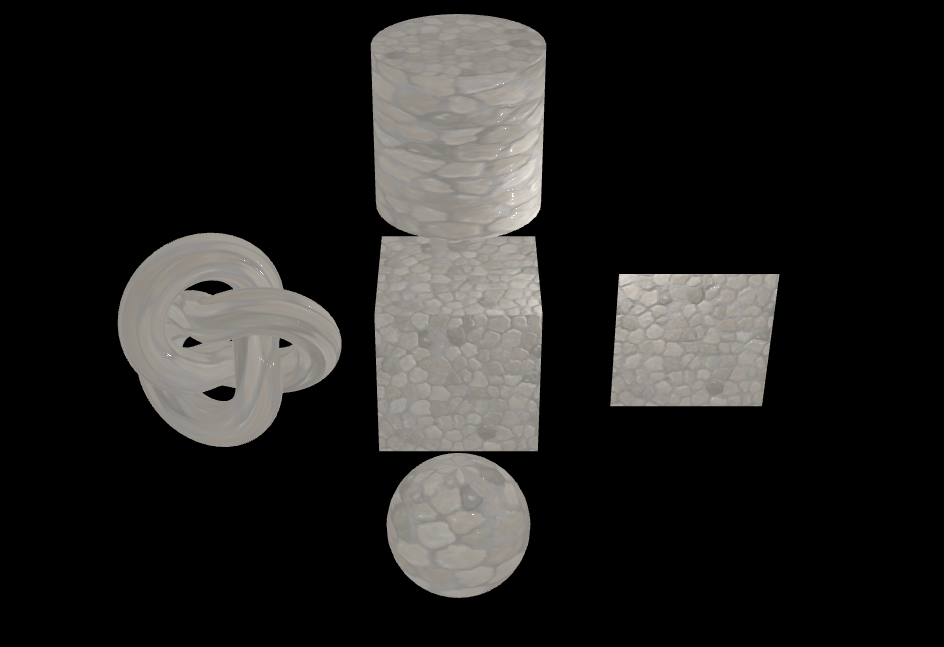

    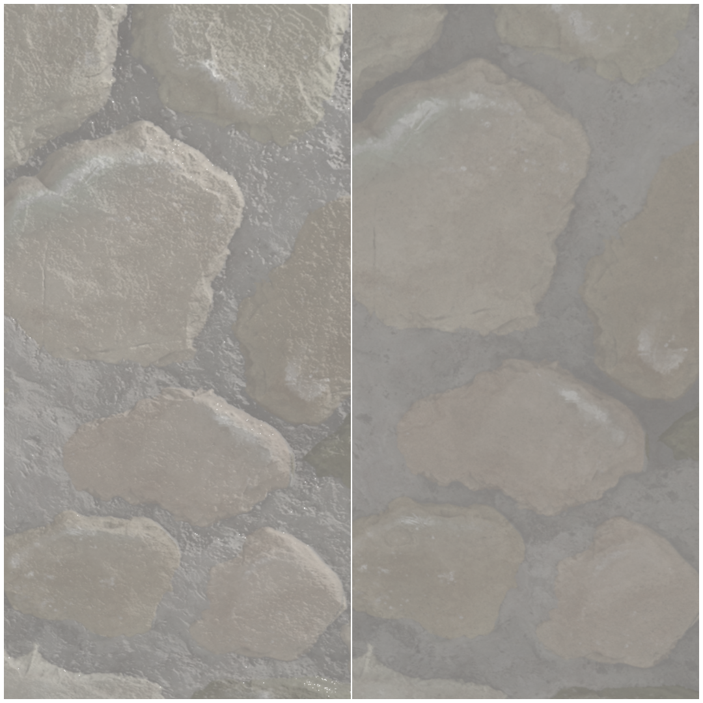

### Height ( Displacement ) Map
- usually called height map in texture files and websites for 3d, but in threejs, it called **Displacement Map**. 
- in normal, roughness or metallic map, we tell how light bounce and behave on surfaces in different ways and angles. but in displacement map, we physically change  the real surface **topology** of the mesh it self.
- after we added normal map, edges of our geometry is still perfectly smooth and liner:

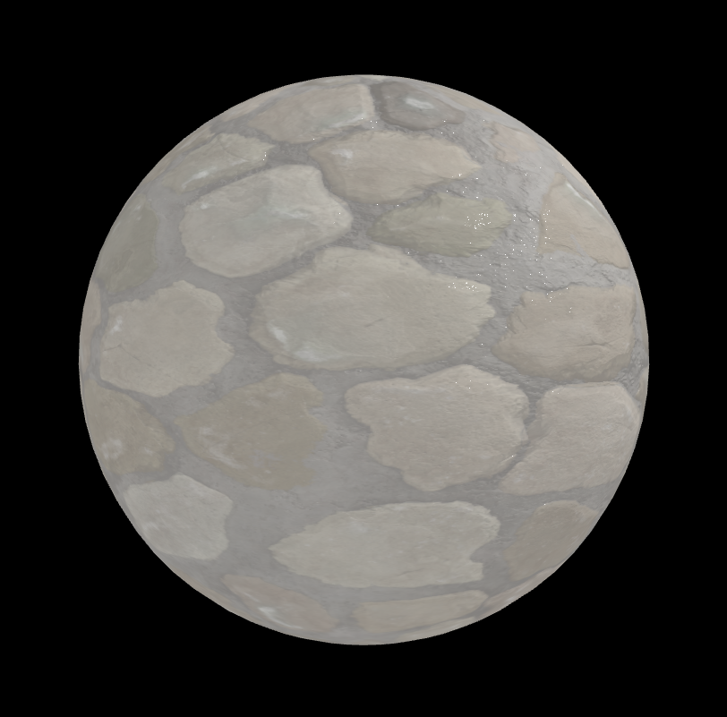

- but with displacement map, we can add real and physical height to the geometry:

```js
const textureHeight = textureLoader.load('/texture/rock-wall-mortar-bl/rock-wall-mortar_height.png');
material.displacementMap = textureHeight;
material.displacementScale = 0.1
```

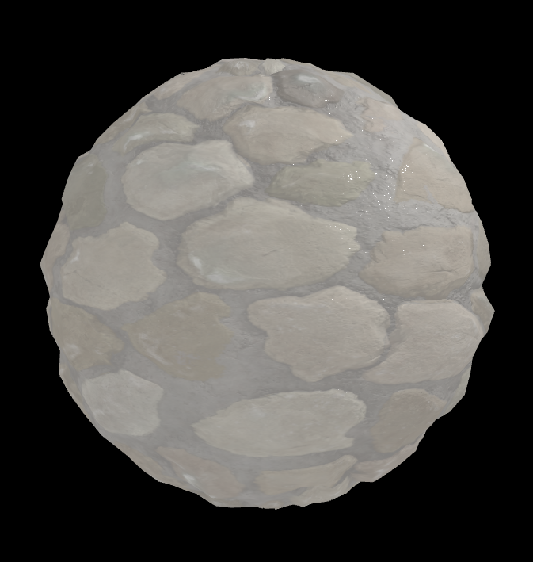

- although, it's not suggested to use this very much, because we actually impact the real geometry of the mesh it self, and sometimes it ruins out shape and make it deformed:

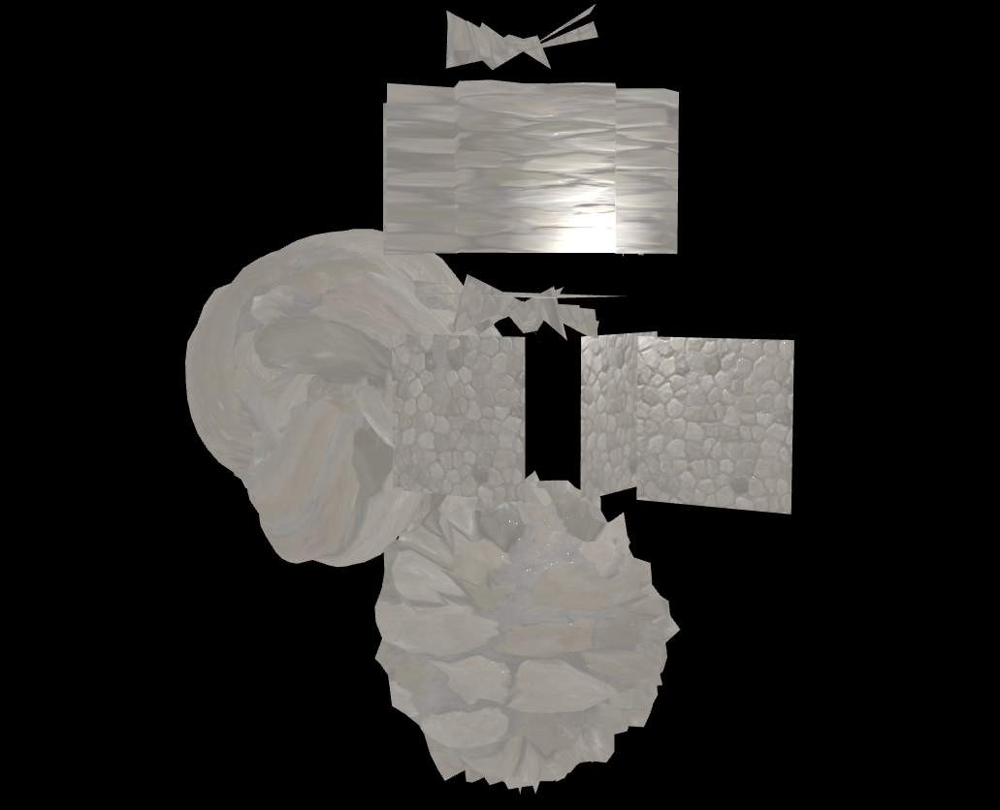

- so it allows you to add real depth to the geometry, but at the cost of increasing triangle that comes at the cost of increase geometry.

### AO Map
- **Ambient Occlusion** is a shading or rendering technique that we use to add more **depth** and **realism** to the scene.
- this map helps us to simulate the way that light is **occluded or blocked** in areas, where objects are close together or one object is casting **shadow** over another.
- so we actually encoding some type of **Shadow** information onto this map, so after adding it to the texture, we add a level of depth with these shadows.
- remember that these shadows are different from the shadows that cast by other objects within the scene. this shadows are actually **cast by the object on itself**.

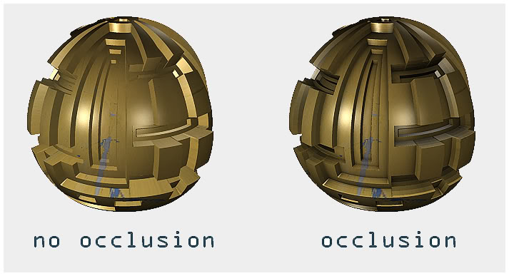

- in threejs docs, it says:
> The red channel of this texture is used as the ambient occlusion map. Requires a **second set of UVs**

- threejs has its own UV map, and it defines how textures are going to map on its own geometries. and this Uv information is actually stored within each geometry:

```js
    - BoxGeometry:
        - attributes:
            - normal
            - position
            - uv
                - array: Float32Array(48) [0, 1, 1, 1, 0, 0, 1, 0, 0, 1, 1, 1, 0, 0, 1, 0, 0, 1, 1, 1, 0, 0, 1, 0, 0, 1, 1, 1, 0, 0, 1, 0, 0, 1, 1, 1, 0, 0, 1, ...]
                - count : 24
                - gpuType: 1015
                - isBufferAttributes: true
                - itemSize: 2
                ...
```

- to create a new set f uv for a geometry, like we create our own position and passed it to the geometry, we should do the same through the **bufferAttribute**, because there is no second set of uvs in geometries, and we have to create one.

- if log the `geometry.attributes.uv.array`, we get this:
```js
Float32Array(48) [0, 1, 1, 1, 0, 0, 1, 0, 0, 1, 1, 1, 0, 0, 1, 0, 0, 1, 1, 1, 0, 0, 1, 0, 0, 1, 1, 1, 0, 0, 1, 0, 0, 1, 1, 1, 0, 0, 1, 0, 0, 1, 1, 1, 0, 0, 1, 0, buffer: ArrayBuffer(192), byteLength: 192, byteOffset: 0, length: 48, Symbol(Symbol.toStringTag): 'Float32Array']
```
- and we can actually use it to pass it as a second set of uv to our geometry, and because the ao map is 2d, we pass the size `2`:

```js
const geometryUv2 = new THREE.BufferAttribute(geometry.attributes.uv.array, 2)
geometry.setAttribute('uv2', geometryUv2);
```
- and in this way, we actually copy the geometry own uv.
- because uv exist in geometry and not mesh, we have to do this for each geometry we have in the scene with ao map.

```js
const cubeGeometryUv2 = new THREE.BufferAttribute(cubeGeometry.attributes.uv.array, 2)
cubeGeometry.setAttribute('uv2', cubeGeometryUv2);
const torusGeometryUv2 = new THREE.BufferAttribute(torusGeometry.attributes.uv.array, 2)
torusGeometry.setAttribute('uv2', torusGeometryUv2);
const planeGeometryUv2 = new THREE.BufferAttribute(planeGeometry.attributes.uv.array, 2)
planeGeometry.setAttribute('uv2', planeGeometryUv2);
const sphereGeometryUv2 = new THREE.BufferAttribute(sphereGeometry.attributes.uv.array, 2)
sphereGeometry.setAttribute('uv2', sphereGeometryUv2);
const cylinderGeometryUv2 = new THREE.BufferAttribute(cylinderGeometry.attributes.uv.array, 2)
cylinderGeometry.setAttribute('uv2', cylinderGeometryUv2);
```

- after that, we can add our `aoMap` to the material, and set the intensity of it:

```js
material.aoMap = textureAo;
material.aoMapIntensity = 1.1
```

- and this is ho it look without/with aoMap:

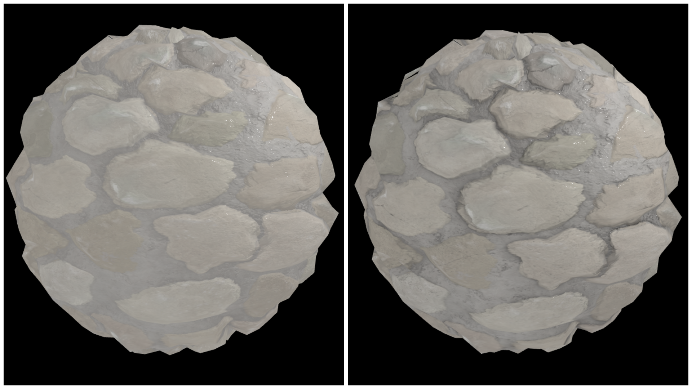