# Texture
## some tips
- like the `position` and `color` we were able to set and change after defining, we are able to do the same with the `Mesh` : 

```js
    const sphere = new THREE.Mesh();
    sphere.geometry = sphereGeometry;
    sphere.material = solidMaterial;
```

- we can add as much meshed items we want in one `scene.add`:

```js
    scene.add(cubeMesh, planeMesh, torusKnotMesh, sphere, cylinderMesh);
```

- we can access all the items inside the scene with `.children`. so if we log `scene.children`, we se an **array** that contains all we added to the scene:

```js
    (7) [AmbientLight, PointLight, Mesh, Mesh, Mesh, Mesh, Mesh]
    0: AmbientLight {isObject3D: true, uuid: 'f6266a31-35f8-49d5-ab64-5718f753ea56', name: '', type: 'AmbientLight', parent: Scene, …}
    1: PointLight {isObject3D: true, uuid: 'fceff394-4bdd-463a-8b2d-b5a5fff67eb1', name: '', type: 'PointLight', parent: Scene, …}
    2: Mesh {isObject3D: true, uuid: '88f2a1e7-a517-4371-a2b8-e8c582ed6f89', name: '', type: 'Mesh', parent: Scene, …}
    3: Mesh {isObject3D: true, uuid: 'f7b2b7da-13c8-4f22-9044-42e463d820cb', name: '', type: 'Mesh', parent: Scene, …}
    4: Mesh {isObject3D: true, uuid: 'ef2ce390-653b-4445-ab1c-1c6dd7b3f8d9', name: '', type: 'Mesh', parent: Scene, …}
    5: Mesh {isObject3D: true, uuid: '7cbccfec-f719-4ca0-8ea4-fe759253c0d1', name: '', type: 'Mesh', parent: Scene, …}
    6: Mesh {isObject3D: true, uuid: 'c3d40b5d-b41c-4ab4-a829-9e751a693d67', name: '', type: 'Mesh', parent: Scene, …}
```
- and we are able to apply functions to all of them at the same time with `forEach`. it is a **JavaScript** method that allows us to do same functions for each direct child of an array. The `forEach()` method calls a function for each element in an array. so for example: 

```js
    scene.children.forEach((child) =>{
        // some code
    })
```
- it contains all the children of the scene, includes meshes, lights etc. if we need to apply function to just one type of these, we are able to do that with `instanceof`. this is also a **JavaScript** operator. The instanceof operator returns true if an object is an instance of a specified object. so for example:

```js
    const cars = ["Saab", "Volvo", "BMW"];

    (cars instanceof Array)   // Returns true
    (cars instanceof Object)  // Returns true
    (cars instanceof String)  // Returns false
    (cars instanceof Number)  // Returns false
```

- so if we need to do some functions, just to an specific type of children of scene, like the meshes, we can use it like this:
```js
    scene.children.forEach((child) =>{
        if(child instanceof THREE.Mesh){
            child.rotation.y += 0.01;
        }
    })
```

- if there was a lot of items in scene, and we just needed some of them, we also can use `group`, and apply function on group, so it applies on all items inside the group:
```js
    const group = new THREE.Group();
    group.add(someItems);

    group.children.forEach((child) =>{
            if(child instanceof THREE.Mesh){
                child.rotation.y += 0.01;
            }
        })
```

## Loading Texture
- you can download many different texture and material for free from [PBR materials](https://freepbr.com/) 

- to add a texture to our project, we first need to create a `textureLoader`, after that, we are able to upload as many texture as we wand in our project and use them:

```js
    // add texture loader
    const textureLoader = new THREE.TextureLoader()

    // create a texture
    const textureWall = textureLoader.load('url')
```

- and after that, we change the `map` method of the material, and set it to out texture:
```js
    const textureMaterial = new THREE.MeshBasicMaterial();
    textureMaterial.map = textureWall;  
```
- after that, we can use that texture in out items in the page:
    - material file:

    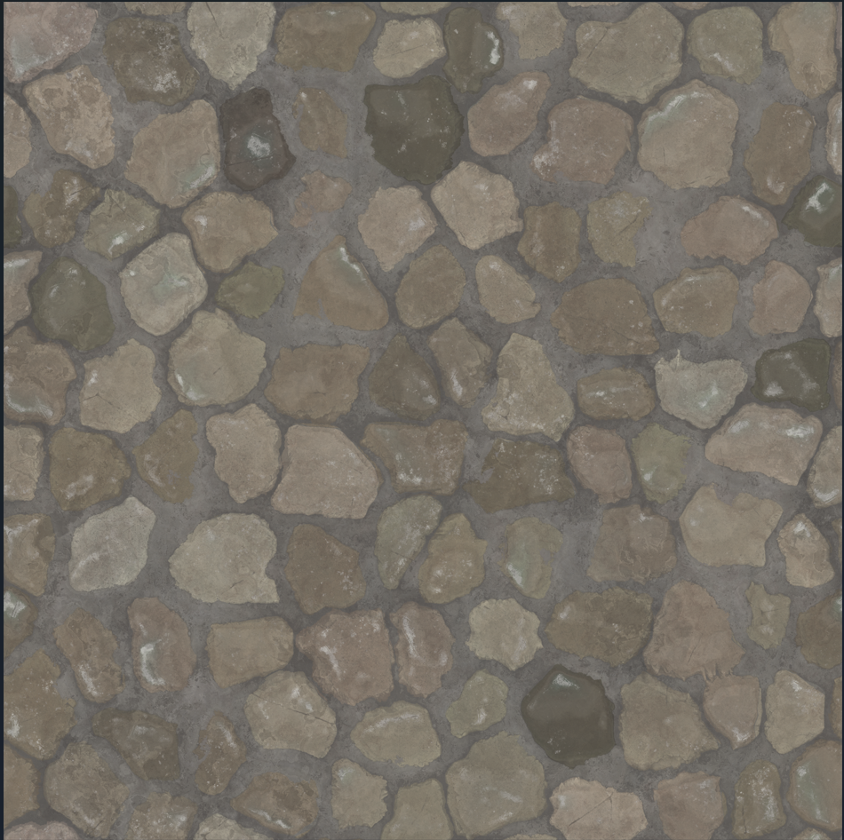

    - result in mesh:

    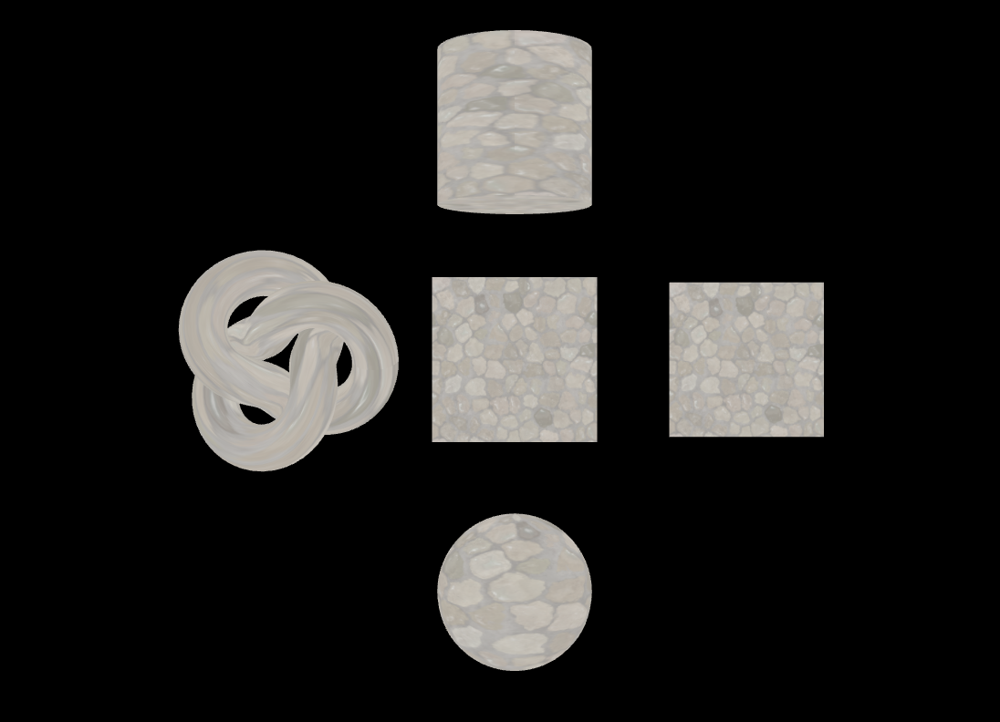

- because in this sample, we use `MeshBasicMaterial`, what ever the main texture image is, will be appear on the item and tere is no response to light or other physical responses. we will change that later.

- as the texture is just part of the material, we still can change methods of the material like color. but it will affect the texture:

    ```js
    textureMaterial.color = new THREE.Color('gold')
    ```
    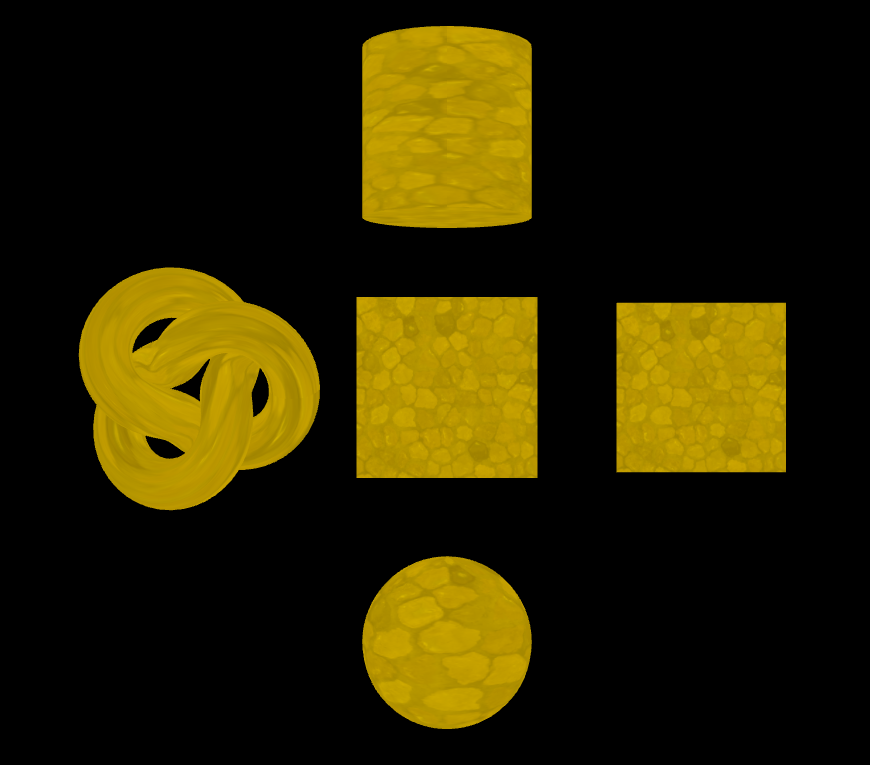

- but we also can change the texture properties it self.

## Texture Properties
### Repeat
- when we add a texture and scale it up, mo matter how high the quality of it is, after zooming enough, it lost quality:

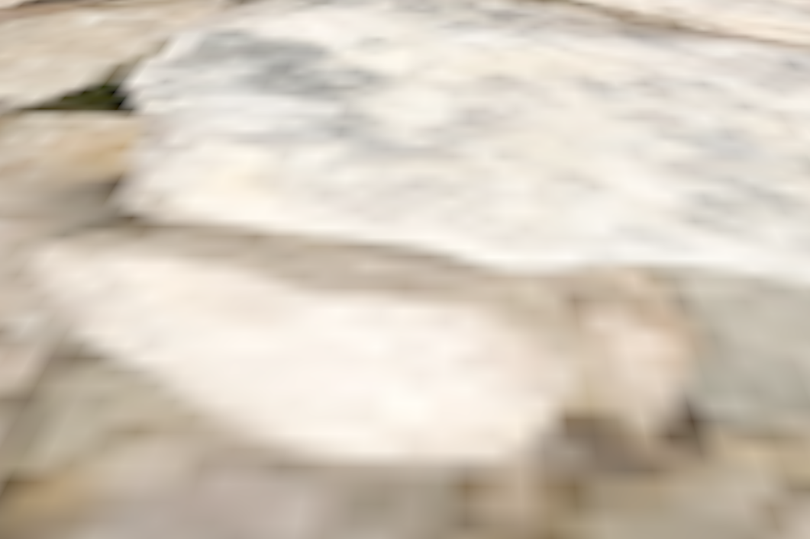

- we can use `.repeat` to prevent this.
```js
textureGround.repeat.set(10,10);
```
- but if we just use this, the texture just placed at the corner of the shape, and stretch to sides:

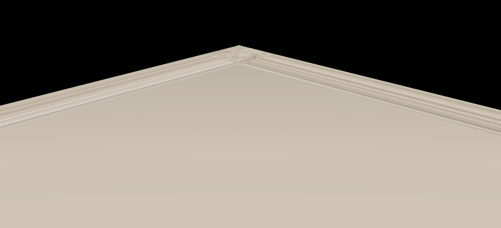

- so we use `wrapS` to repeat it in `x-axis`:
```js
textureGround.wrapS = THREE.RepeatWrapping;
```

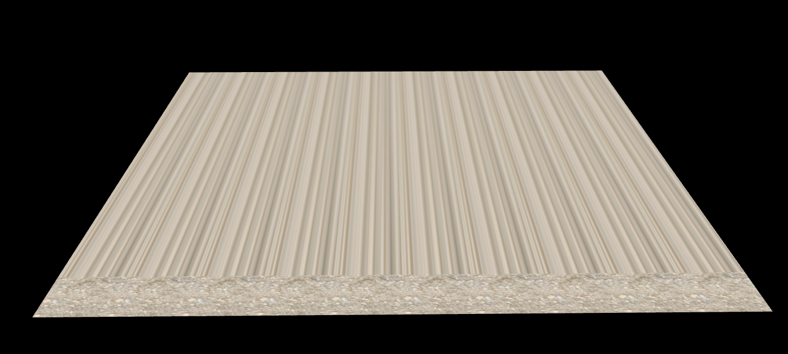

- and use `wrapT` to repeat it in `y-axis`:
```js
textureGround.wrapT = THREE.RepeatWrapping;
```

- so the final result would be:
```js
textureGround.repeat.set(100,100);
textureGround.wrapS = THREE.RepeatWrapping;
textureGround.wrapT = THREE.RepeatWrapping;
```
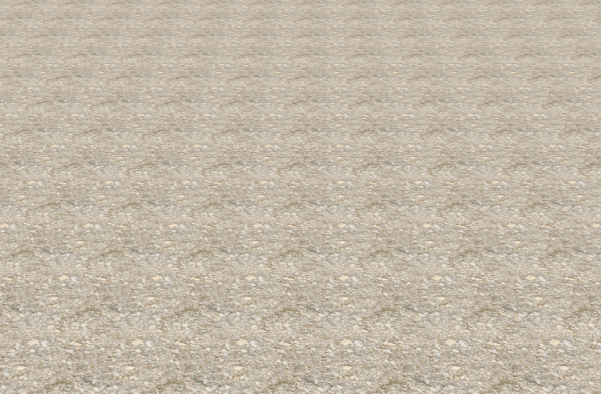

- as seen in the image, the repeat is so obvious, and it's not easy to hide this repetition patters, but we can use other type of wrapping to hide it. like `MirroredRepeatWrapping`:

```js
textureGround.repeat.set(100,100);
textureGround.wrapS = THREE.MirroredRepeatWrapping;
textureGround.wrapT = THREE.MirroredRepeatWrapping;
```
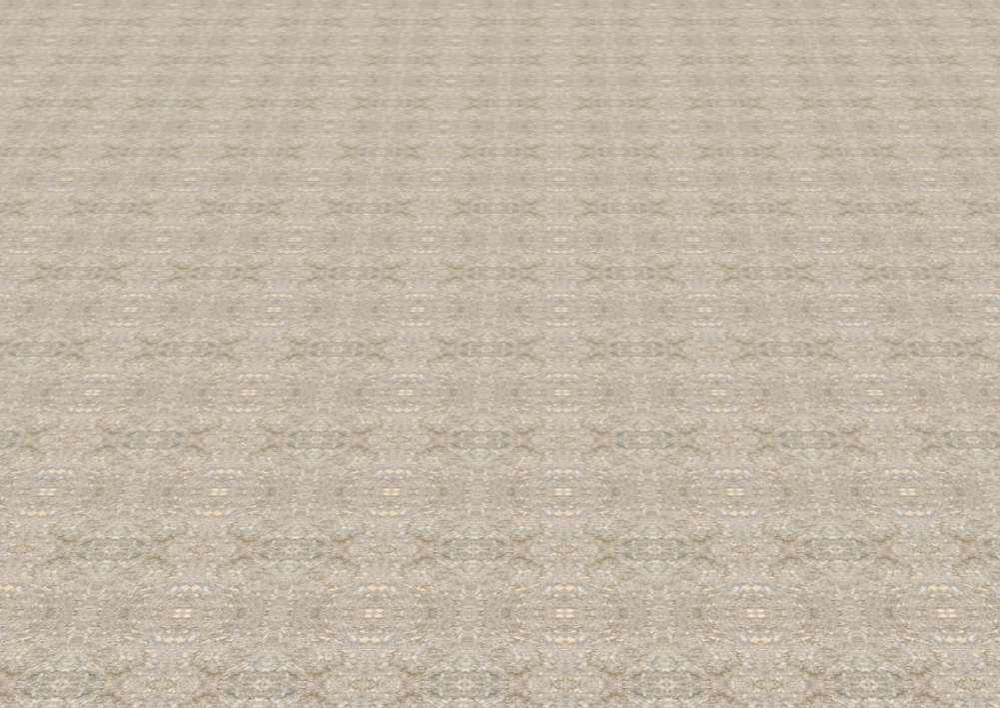

### offset
- it change the position of the texture base on the shape:
```js
textureGround.offset.x = 0.5
```

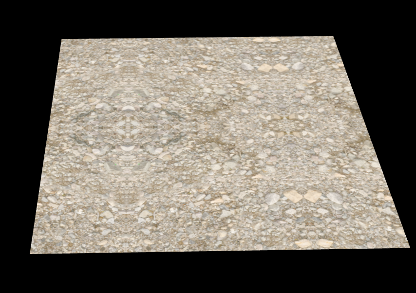

### UV Map
- as you see, same texture applies differently on each item:

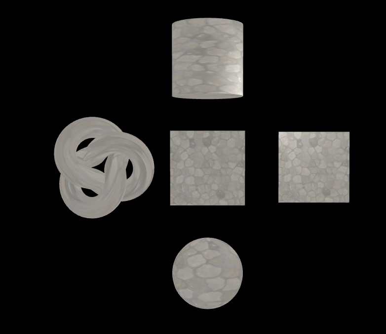 

- **UV Map** is a way to tell 3js how map a texture on an item.

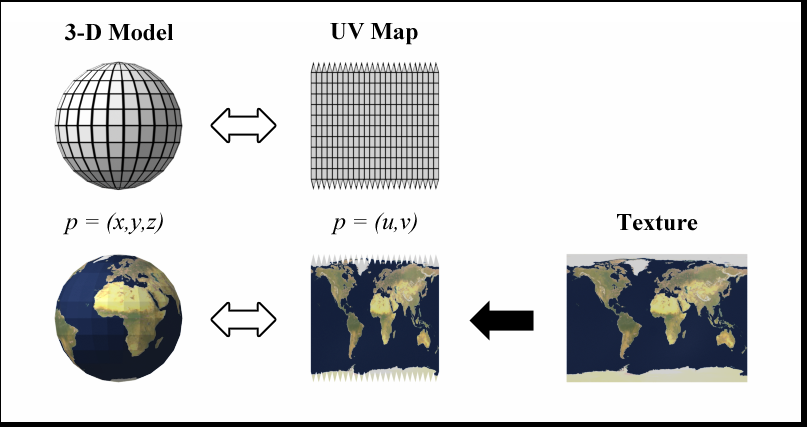
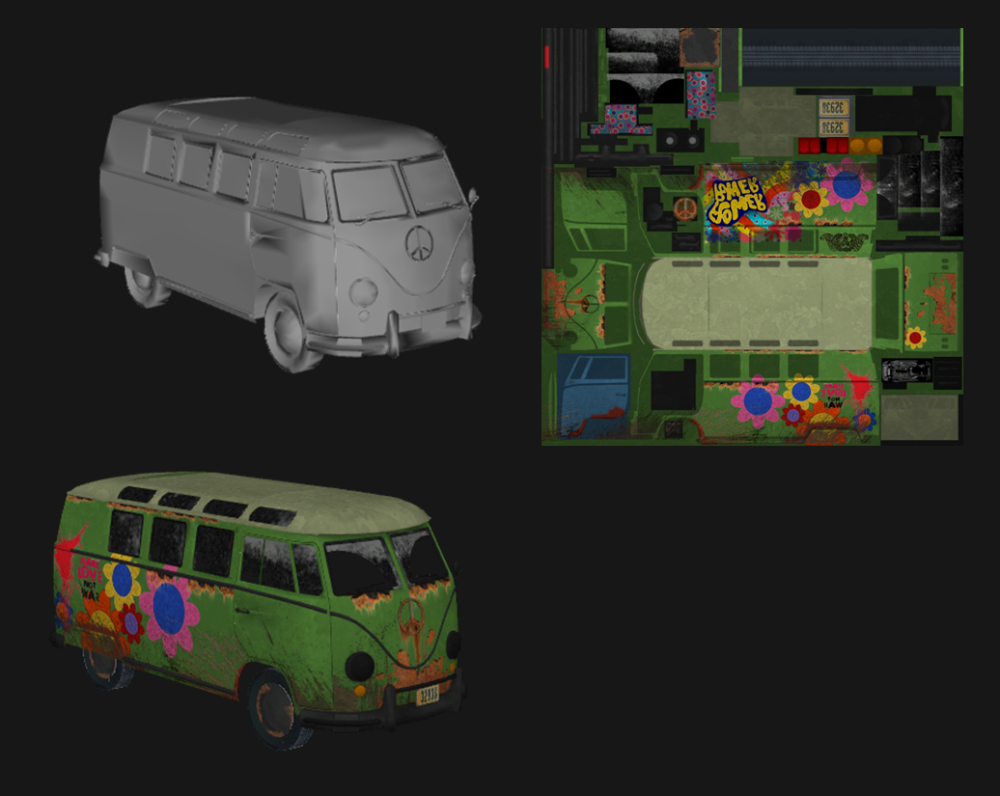
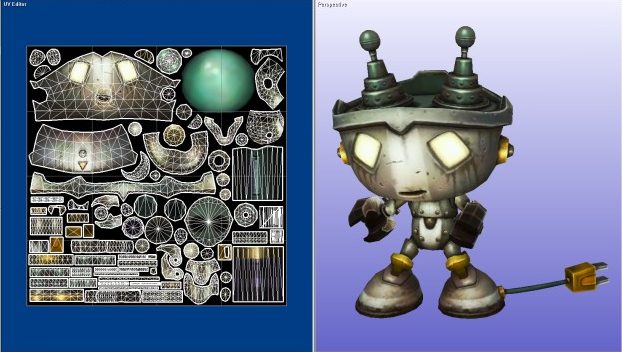

- threejs and blender have different default uv map logic. blender opens the item faces, and map one texture to whole of it. but threejs map texture to each face of item, separately:

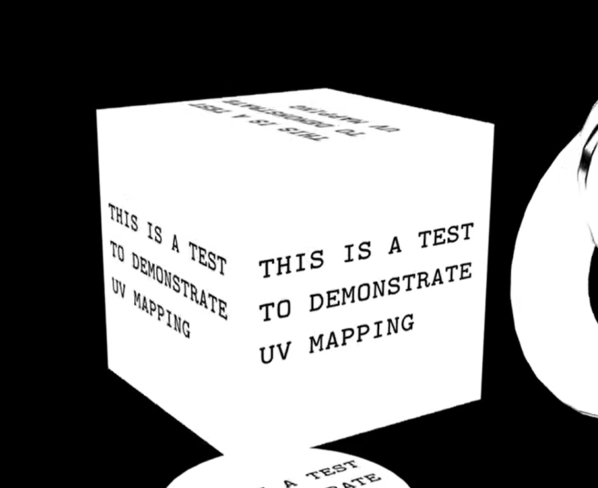
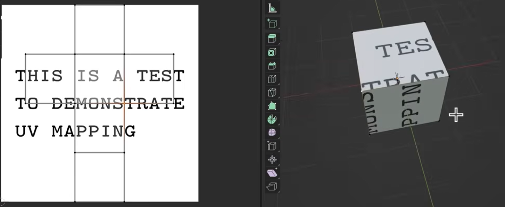

### PBR Map